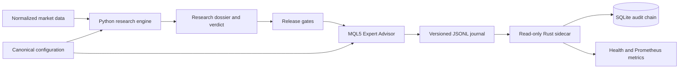

# Aegis Meridian

**Reproducible trading research, guarded MT5 execution, and independent telemetry**  
Python · MQL5 · Rust · SQLite · JSON Schema · Prometheus · PowerShell

Aegis Meridian separates strategy research, broker execution, and audit collection into three components. It targets multi-horizon trend-following research for externally priced MT5 instruments, with explicit evidence requirements before live execution can be enabled.

## Architecture

## Research engineering

The Python package implements an event-driven simulator with point-in-time signals, bid/ask costs, broker-aware sizing, cost attribution, walk-forward evaluation, bootstrap uncertainty, and overfitting diagnostics. Research runs produce structured dossiers and explicit acceptance or rejection verdicts.

Canonical configuration generation and golden vectors align the research calculations with the execution implementation. A strategy is not promoted just because a backtest returns a positive number.

## Execution engineering

The native MQL5 Expert Advisor implements lifecycle and account checks, configuration identity checks, completed-bar signals, ATR-based protection, portfolio limits, spread and quote guards, idempotent order intents, broker preflight checks, server-side stops, and transaction reconciliation.

The EA is the only order-capable component. Research and telemetry do not receive trading authority.

## Audit and operations

The Rust sidecar validates event envelopes, handles incomplete journal writes, detects duplicates and sequence gaps, and persists a SHA-256 hash chain in SQLite. Health endpoints, Prometheus metrics, durable alerts, and operational runbooks support diagnosis without coupling monitoring to order placement.

## Recorded validation

The **3 August 2026 implementation record** reports:

- 16 Python tests, strict Mypy, Ruff, and five golden vectors passing.
- The Expert Advisor and supporting MQL5 scripts compiling with zero errors and zero warnings.
- Five Rust tests, Rustfmt, Clippy, and an optimized Windows build passing.
- Configuration, event, dossier, and release schemas validating.
- A deliberately edge-free dataset producing `RESEARCH_REJECTED`, with the rejected dossier refused for canary release.

These are historical validation results from the project record, not tests rerun for this portfolio.

## Project status

Implemented research and shadow system. The recorded artifact is incapable of live order submission. Passing production evidence and profitable trading performance are not claimed.

## What this project demonstrates

Cross-language contracts, quantitative software implementation, simulation, reproducibility, execution controls, audit integrity, and engineering systems that can reject their own outputs.

[Back to portfolio](README.md)
