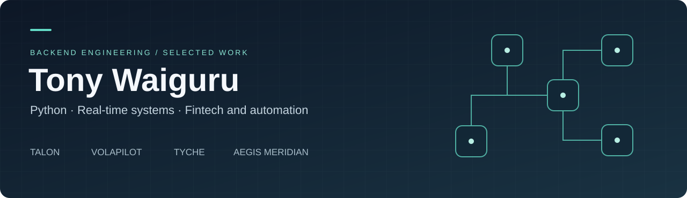

  

# Tony Waiguru

### Python Backend Developer · Real-Time Systems · Fintech and Automation

I am a Nairobi-based developer with a Diploma in Telecommunications Engineering and a practical background in broadcast, aviation communications, and IT networks. I build software that connects live events to controlled actions and durable records. My work spans Python account orchestration, Rust network workers, transaction reconciliation, trading research, and TypeScript product interfaces.

My main projects are **Talon**, **VolaPilot**, **Tyche**, and **Aegis Meridian**. Together, they show how I approach concurrency, external APIs, persistence, performance, and recovery in systems that need to keep operating beyond a successful demo.

**Explore:** [Projects](#selected-projects) · [Technical capabilities](SKILLS.md) · [Engineering approach](ENGINEERING.md) · [Download CV](Tony_Waiguru_CV.pdf)

**Connect:** [Email](mailto:tonygatitu10@gmail.com) · [LinkedIn](https://www.linkedin.com/in/tony-waiguru-649246192) · [VolaPilot](https://volapilot.com/)

**Open to opportunities:** Python backend development, software development and automation — full-time or contract, remote or Nairobi hybrid/on-site. [Recruiter overview](HIRING.md) · [CV PDF](Tony_Waiguru_CV.pdf) · [Editable CV](Tony_Waiguru_CV.docx)

### Start here

- **Backend and reliability:** [Talon's architecture and transaction recovery](TALON.md).
- **Product and API integration:** [VolaPilot's trading workspace](VOLAPILOT.md) and [live site](https://volapilot.com/).
- **Performance and debugging:** [Tyche's runtime improvements](TYCHE.md).
- **Research and validation:** [Aegis Meridian's guarded release process](AEGIS_MERIDIAN.md).

## Selected projects

| Project | What it does | Main technologies |
| --- | --- | --- |
| **[Talon](TALON.md)** | Separates real-time event processing, account orchestration, durable transaction state, and operator controls | Python, Rust, Tokio, WebSockets, SQLite, systemd |
| **[VolaPilot](VOLAPILOT.md)** | Connects live market analysis, controlled order flows, practice, replay, and trade review | TypeScript, React, Next.js, Cloudflare Workers/D1, Deriv API |
| **[Tyche](TYCHE.md)** | Improves the responsiveness and recovery of a long-running Python automation runtime | Python, asyncio, uvloop, websockets, Patchright, Linux |
| **[Aegis Meridian](AEGIS_MERIDIAN.md)** | Separates reproducible strategy research, guarded MT5 execution, and independent audit telemetry | Python, MQL5, Rust, SQLite, Prometheus |
| **[Helios and Spectre](EARLIER_SYSTEMS.md)** | Earlier session automation, event integration, persistence, and Telegram control systems | Python, browser automation, WebSockets, Telegram |

### Talon

Talon is the clearest example of my backend and systems work. Rust workers handle latency-sensitive STOMP/WebSocket reception and independent account writer lanes. Python actors handle authentication, account state, and transaction workflows. A dedicated State service owns SQLite writes and exposes projections to the Telegram operator console.

The design keeps browser and database work outside the networking critical path and preserves ambiguous transaction outcomes for reconciliation. A recorded August 2026 release gate reports **393 Python tests and 41 Rust tests**, with strict static checks and a documented deployment procedure.

[Read the Talon case study →](TALON.md)

### VolaPilot

VolaPilot brings the systems work into a user-facing trading product. It combines market history and streaming ticks, entry analysis, manual and automated execution controls, account switching, recovery, replay, and operational visibility.

A September 2026 local benchmark measured selected-rule refresh calculations at **2.20× faster for Over** and **3.01× for Under** after removing repeated work. The comparison preserved continuous-feed results. Those figures describe calculation time, not order latency or trading returns.

[Read the VolaPilot case study →](VOLAPILOT.md) · [Visit VolaPilot](https://volapilot.com/)

### Tyche

Tyche shows the diagnostic work behind the later architecture: supervised event loops, bounded queues, batched persistence, crash-safe JSON replacement, controlled logging, and measurements for event-loop lag, memory, file descriptors, and dispatch timing. It connects operational problems to specific engineering changes.

[Read the Tyche case study →](TYCHE.md)

### Aegis Meridian

Aegis Meridian connects a Python research engine, a native MQL5 Expert Advisor, and a read-only Rust telemetry sidecar. Versioned schemas, configuration hashes, golden vectors, and explicit release decisions align the three implementations. A deliberately edge-free dataset was rejected by the research gate and refused for canary release.

[Read the Aegis Meridian case study →](AEGIS_MERIDIAN.md)

## What I bring to a team

- **Asynchronous backend development:** account actors, streaming integrations, task supervision, bounded queues, and independent failure handling.
- **Reliable transaction workflows:** durable intents, idempotency, explicit state transitions, reconciliation, and recovery after uncertain responses.
- **Performance investigation:** clearly defined timing boundaries, event-loop and memory measurements, regression comparisons, and reversible changes.
- **Operational discipline:** Linux services, readiness checks, immutable releases, backups, runbooks, and useful operator interfaces.
- **Product delivery:** typed domain logic, authentication, responsive React interfaces, API integration, and behavior-focused validation.

## Technical stack

**Core:** Python, asyncio, Rust, Tokio, SQL, SQLite, WebSockets, STOMP.  
**Product:** TypeScript, JavaScript, React, Next.js, Vite, Tailwind CSS.  
**Integrations:** Deriv API, Telegram Bot API, OAuth, Patchright, MT5/MQL5.  
**Operations and quality:** Linux, AWS EC2, systemd, Cloudflare Workers/D1, Git, Bash, PowerShell, pytest, Mypy, Ruff, Clippy, Prometheus.

[See how each capability maps to a project →](SKILLS.md)

## How I work

I prefer explicit state, clear ownership, and observable failure modes. I use AI-assisted development as part of the workflow, with implementation decisions checked against source, tests, logs, and reproducible comparisons. I document what a result establishes and what still needs validation.

## Areas of interest

Python backend engineering, real-time integrations, automation platforms, transaction processing, and fintech/trading infrastructure. My project work also includes Rust services and TypeScript application development.

## Telecommunications foundation

My technical foundation includes a telecommunications internship at **Kenya Broadcasting Corporation** (January-April 2024), an aeronautical telecommunications attachment at **Kenya Civil Aviation Authority** (February-April 2022), and a broadcast/IT attachment at **Heaven Bound TV** (August-November 2021).

I hold a **Diploma in Telecommunications Engineering from the East African School of Aviation** (2019-2022). Working with transmission systems, networking, and technical faults informs how I approach observability and recovery in software.

## About this portfolio

These pages describe independently developed projects. The application implementations remain private; this repository contains public technical case studies and my CV. Historical validation results are labelled with their context. Trading profitability, current uptime, and unverified commercial scale are not claimed.

Application verification: 2026-09-23
