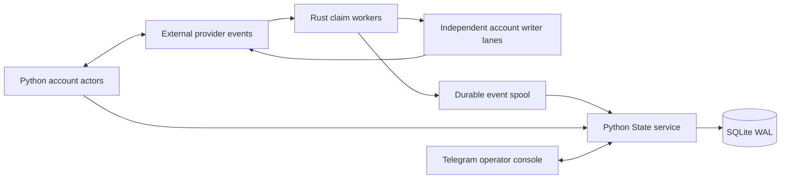

# Talon

**Real-time event processing, account orchestration, and durable financial state**  
Python · Rust · Tokio · asyncio · STOMP/WebSockets · SQLite WAL · Linux · systemd

Talon is my successor to Tyche, an earlier Python automation runtime. It coordinates event-driven workflows across external gaming providers, keeps transaction state durable, and gives an operator visibility through Telegram. The engineering challenge is to preserve responsiveness while authentication, browser sessions, network connections, and financial workflows fail independently.

## The problem

A single runtime makes it easy for browser work, database writes, or a stalled account to delay unrelated network activity. Transaction retries introduce a second problem: a timeout does not prove that an external action failed. Repeating an ambiguous action can be worse than pausing it.

## System design

- **Rust claim workers** receive and parse STOMP/WebSocket events, deduplicate opportunities, and fan out to bounded, independent account writers. Database and browser work stay outside this critical path.
- **Python account actors** own provider authentication, browser lifecycle, policy, game interaction, settlement, and withdrawal coordination.
- **A dedicated State service** is the sole durable SQLite writer. It owns events, projections, journal records, command history, migrations, and lifecycle operations.
- **The Telegram console** reads projections and submits audited commands. It does not own provider sockets or write directly to the database.
- **Linux services** provide explicit process boundaries, readiness checks, backup timers, resource limits, and controlled recovery.

## Engineering decisions

### Independent work stays independent

Per-account writer lanes prevent one account's socket from serializing all other writes. Bounded queues expose pressure instead of allowing unlimited memory growth. Rust isolates the latency-sensitive path from Python's GIL and browser execution.

### Transaction state survives uncertainty

Withdrawal workflows distinguish preparation, provider submission, acknowledgement, verification, and terminal state. Ambiguous results block resubmission until reconciliation establishes what happened. A local send is recorded as a send; provider acceptance requires separate evidence.

### Persistence has one owner

SQLite WAL supports durable events and projections behind a single writer. Live archive pruning is routed through the State service rather than opening a competing writer. This keeps maintenance within the same ownership rules as ordinary application work.

### Recovery has a bounded scope

Account-scoped connection failures receive scoped backoff and credential recovery. Restart procedures preserve financial records, and release tooling separates the immutable application build from runtime state.

## Evidence

The recorded **24 August 2026 release gate** reports **393 Python tests and 41 Rust tests**, alongside strict Mypy, Ruff, Rustfmt, Clippy, and an optimized build. The release record describes six configured accounts reaching readiness. These are historical release results, not a new test run or a current uptime claim.

## What this project demonstrates

Concurrent backend programming, service ownership, asynchronous I/O, protocol integration, durable workflow design, idempotency, financial reconciliation, operational observability, and production incident diagnosis.

## Project status

Private implementation with documented deployment history. This page is a public technical overview. Credentials, account data, raw financial records, provider configuration, and production infrastructure identifiers are excluded.

[Back to portfolio](README.md)
