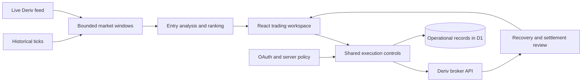

# VolaPilot

**A trading workspace connecting live market data, controlled execution, and decision review**  
TypeScript · React · Next.js · Vite · Cloudflare Workers · D1 · Drizzle ORM · Deriv API

VolaPilot brings live synthetic-market review, entry analysis, manual and automated order flows, practice, replay, and trade review into one application. My focus is the whole path from incoming ticks to a clearly explained execution outcome.

**Product:** [volapilot.com](https://volapilot.com/)

## The problem

A trading interface has to remain responsive while market data changes continuously. It must also represent external order state accurately: requesting a purchase, receiving broker acceptance, opening a contract, and observing settlement are different events. Feed interruptions and uncertain requests need explicit recovery.

## Architecture

## Product and backend work

- Historical data loads before live streaming, with a bounded **1,000-tick window per market**.
- Manual, Bulk, Auto Trader, and Auto Bulk share an order surface and an execution lock.
- Automation exposes stake, run limits, loss stops, and profit stops. Demo and Real account state remain distinct.
- Interrupted purchases enter an explicit recovery path. An uncertain response is not blindly retried.
- Authentication and session components cover Deriv OAuth, encrypted session handling, request-origin checks, and account-feed recovery.
- An owner interface supports operational events, latency investigation, runtime controls, and support workflows.
- The persistence layer includes consent, support records, and pseudonymized operational identifiers using D1 and Drizzle.
- Replay, saved Strategy Lab profiles, and journal analytics support investigation of decisions and outcomes.

## An engineering example

### Correcting stale evidence after a feed interruption

The scanner could compress a long outage into a small number of array positions. Two new ticks could therefore make old outcomes appear recent. The revised calculation uses elapsed market intervals from broker timestamps, including missing intervals, and rejects invalid clock evidence.

The same release reduced repeated work when refreshing an already selected rule. A local benchmark against the previous implementation compared twelve continuous-feed results across four contracts and three durations. Results matched apart from the engine-version identifier. Median refresh improvements were **2.20× for Over** and **3.01× for Under** across five alternating 200-call batches.

These figures measure selected-rule calculation time in a local benchmark. They do not measure overall application speed, broker execution latency, or trading profitability.

## Validation approach

The release tooling includes type checking, linting, scanner regressions, replay tests, execution and recovery mocks, account lifecycle checks, request security, bundle budgets, and production build checks. The 22 September 2026 release review records completed checks for the scanner freshness change; that release was prepared locally and its publication was blocked at the time of the record.

## What this project demonstrates

End-to-end product engineering, typed domain models, streaming data, external API integration, authentication, stateful interfaces, failure recovery, regression testing, and performance work with a clearly defined measurement boundary.

## Project status

A product with a public URL and an actively developed private codebase. Local release capabilities may differ from the hosted version. Operational financial metrics are labelled client-observed where broker reconciliation is incomplete.

[Back to portfolio](README.md)
